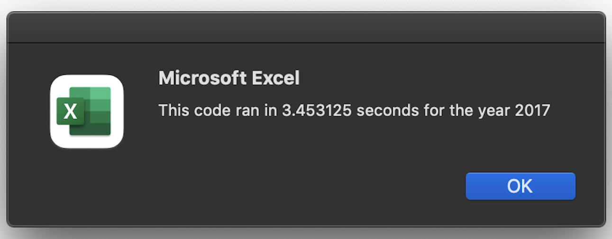
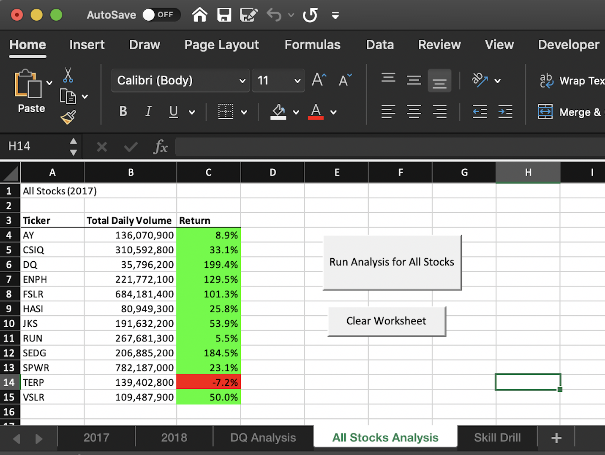
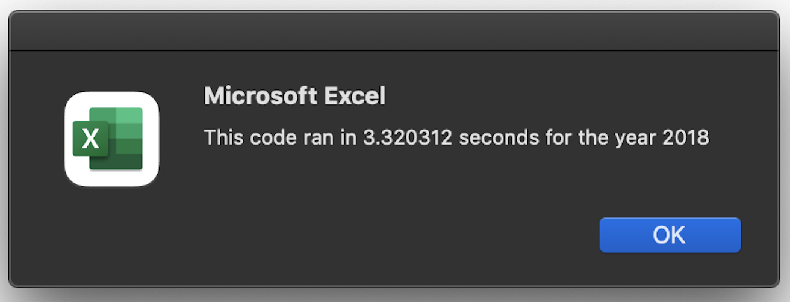
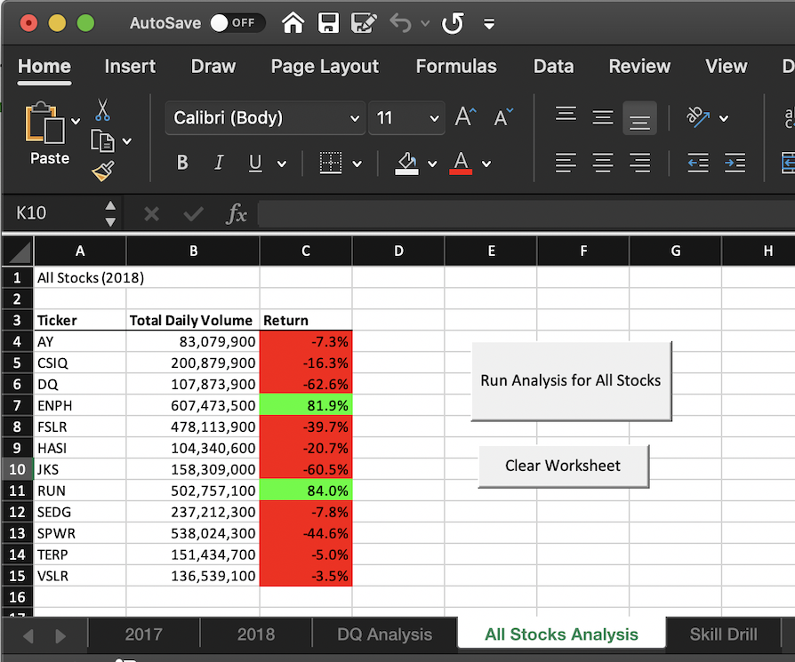

# **stock-analysis**

## Overview of Project:
*Explore green energy stock perfomance by analyzing financial data using VBA*

#### *Purpose:*
Throughout Module 2 the goal was to help Steve, a Finance graduate, find a way he could quickly analyze an entire dataset at the click of a button. Steve would use this information to advise his clients/parents on the stock market as an investment. The purpose of this challenge is to refactor the Module 2 solution code, so that the VBA script could run faster. A refactored code would enable Steve to analyze a larger data set (the entire stock market) in a more efficient manner.

#### *Background:*
Steve, a Finance graduate, was in search of a way he could quickly analyze an entire dataset of stocks at the click of a button. As he begins his financial advisory practice, his parents became his first clients. Steve’s parents have been seeking to invest in green energy stocks, however they need more information. Using the VBA extension, I was able to build a workbook that automated task interacting with Excel. This project allowed Steve to quickly access 12 green energy stocks and provide a potential diversified portfolio for his parents. 

## Results:

Using images and examples of your code, compare the stock performance between 2017 and 2018, as well as the execution times of the original script and the refactored script.

With the purpose of this analysis definded, one main deliverable be neccessary to perform. 
- Refactor VBA code and measure performance
This deliverable will include an updated workbook and a folder with PNGs of the pop-ups with script run time.

Once the given files had been downloaded and named appropriately, the following septs were taken to perfomr the above necessary deliverables chronologically :

1. (Step 1a.)Create a tickerIndex variable and set it equal to zero before iterating over all the rows. You will use this tickerIndex to access the correct index across the four different arrays you’ll be using: the tickers array and the three output arrays you’ll create in Step 1b.

'Dim tickerIndex As Single'
'tickerIndex = 0'

2. (Setp 1b.)Create three output arrays: tickerVolumes, tickerStartingPrices, and tickerEndingPrices. The tickerVolumes array should be a Long data type. The tickerStartingPrices and tickerEndingPrices arrays should be a Single data type.

'Dim tickerVolumes(12) As Long'
'Dim tickerStartingPrices(12) As Single'
'Dim tickerEndingPrices(12) As Single'

3. (Step 2a.)Create a for loop to initialize the tickerVolumes to zero.

4. (Step 2b.)Create a for loop that will loop over all the rows in the spreadsheet.

5. (Step 3a.)Inside the for loop in Step 2b, write a script that increases the current tickerVolumes (stock ticker volume) variable and adds the ticker volume for the current stock ticker. Use the tickerIndex variable as the index.

6. (Step 3b.)Write an if-then statement to check if the current row is the first row with the selected tickerIndex. If it is, then assign the current starting price to the tickerStartingPrices variable.

7. (Step 3c.)Write an if-then statement to check if the current row is the last row with the selected tickerIndex. If it is, then assign the current closing price to the tickerEndingPrices variable.

8. (Step 3d.)Write a script that increases the tickerIndex if the next row’s ticker doesn’t match the previous row’s ticker.

9. (Step 4.)Use a for loop to loop through your arrays (tickers, tickerVolumes, tickerStartingPrices, and tickerEndingPrices) to output the “Ticker,” “Total Daily Volume,” and “Return” columns in your spreadsheet.

10. Finally, run the stock analysis, then confirm that your stock analysis outputs for 2017 and 2018 are the same as they were in the module. Savethe pop-up messages showing elapsed run time for the refactored code for each year. *Below are the screen-shot images of the results and run time from the code ran above.*

## Summary:

  ### What are the advantages or disadvantages of refactoring code?
  ### How do these pros and cons apply to refactoring the original VBA script?
